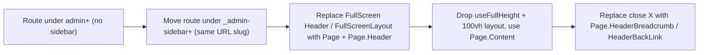
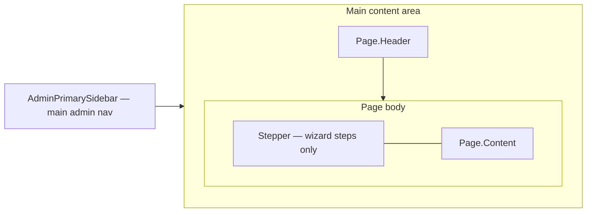
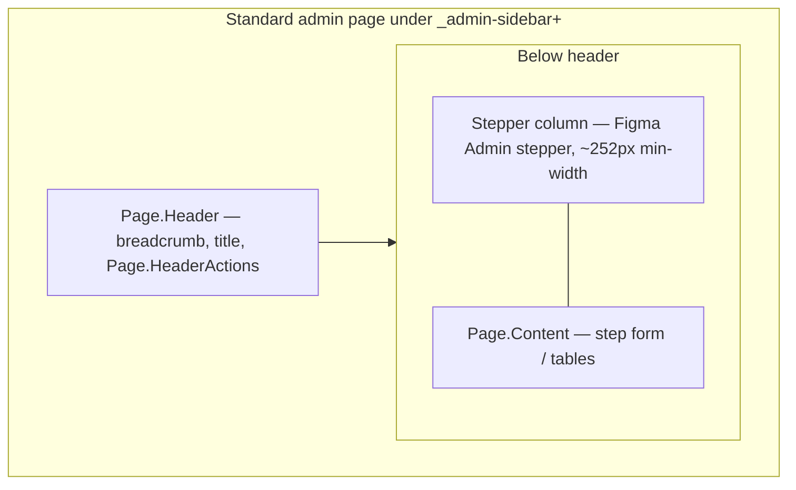

# Admin Full-Screen Modal -> Standard Page Migration

## What the Figma header maps to in code

The Figma node (`Page Header / Admin`, variants Main / Drilldown / Profile / Company) is already implemented in the design system as the compound `Page` / `Page.Header` component, which the non-admin side and admin **list** pages already use. There is no new component to build; migration means swapping fullscreen chrome for this existing header.

- Component: [`packages/design-system/components/Page/index.tsx`](packages/design-system/components/Page/index.tsx) and [`packages/design-system/components/Page/Header/index.tsx`](packages/design-system/components/Page/Header/index.tsx)
- Sub-parts available: `Page.HeaderTitle`, `Page.HeaderActions`, `Page.HeaderDescription`, `Page.HeaderBackLink`, `Page.HeaderBreadcrumb`, `Page.Content`
- Figma variant -> code mapping:
  - "Main" (32px title) = top-level list page
  - "Drilldown" (breadcrumb + 24px title + optional edit icon/badge + actions + optional tabs) = a page reached from a list (this is what migrated create/edit flows become)
  - Tabs in the Figma header = `Tabs` design-system component rendered under the header

A live reference of the target is already in code: the SFTP **list** page [`apps/dazzle/src/modules/Company/SFTPCenter/index.tsx`](apps/dazzle/src/modules/Company/SFTPCenter/index.tsx) uses `Page` + `Page.Header*`.

## Admin primary buttons (blue)

Admin CTAs must match the [Core Components 2.0 Button](https://www.figma.com/design/nLUlfPtcj5Jt99tzI4DxDx/%F0%9F%8C%BF-Core-Components-2.0?node-id=2-921) — specifically **`variant=primary`, `size=medium`** as the default header/page action (Figma node `2:922`). Primary buttons use **blue** (`info.500` / `#196dca`), white label text, and the standard medium shadow — not the accent (purple) primary used on the non-admin employee experience.

**In code (no custom styling needed):**

- Component: [`@latticehr/design-system/Button`](packages/design-system/components/Button/index.tsx)
- Usage: `<Button variant="primary" size="md">...</Button>` (or `size="lg"` only where the existing flow already uses large footer CTAs)
- Admin blue is applied automatically when the page is under admin `PageContext` (`isAdminPage: true`). The `_admin-sidebar+` layout provides this via [`PageContextProvider isAdminPage`](apps/dazzle/app/routes/_authenticated+/_admin-sidebar+/_layout.tsx). Tests confirm: primary uses `info.500` when `isAdminPage` is true, accent when false ([`Button.test.tsx`](packages/design-system/components/Button/__tests__/Button.test.tsx)).
- Header actions per Figma Page Header / Admin: primary CTA in `Page.HeaderActions`; secondary/outline actions use `variant="secondary"`.

**Migration checklist for every flow:**

1. Route must render under `_admin-sidebar+` (or another layout that sets `PageContextProvider isAdminPage`) so primary buttons pick up admin blue — not only the header swap.
2. Do not hardcode accent/purple button colors or legacy button components from fullscreen layouts.
3. When moving footer primary buttons into `Page.HeaderActions`, use `variant="primary"` + `size="md"` to match Figma and the SFTP center list page pattern.

**Phase 1 note:** The current create-report footer uses `<Button>` without an explicit `variant` (defaults to primary) but the page lives outside `_admin-sidebar+`, so it may not get admin blue until the route move. After migration, explicitly use `variant="primary"` `size="md"` in `Page.HeaderActions` for "Next: Configure report columns".

## What a "full-screen modal" actually is here

These are not React modal overlays. They are routes rendered **outside** the admin sidebar (under pathless layout segments like `admin+/...` without `_admin-sidebar+`, or families like `_review-cycle-setup+`, `_manage-comp-cycle+`). Their chrome comes from one of two stacks — **both are in scope** for this initiative:

- Legacy `@latticehr/components/layouts/FullScreen` -> `Header` + `Sidebar` ([`packages/components/src/layouts/FullScreen/Header/index.tsx`](packages/components/src/layouts/FullScreen/Header/index.tsx))
- DS `@latticehr/design-system/FullScreenLayout` ([`packages/design-system/components/FullScreenLayout/index.tsx`](packages/design-system/components/FullScreenLayout/index.tsx)) — e.g. Grow track settings (`TrackContainer.tsx`)

They typically force `100vh` via `useFullHeight` ([`apps/dazzle/src/hooks/useFullHeight.tsx`](apps/dazzle/src/hooks/useFullHeight.tsx)) and render a `close`/back `BackButton` instead of a breadcrumb.

## General migration pattern (applies to every flow)



1. **Move the route** from `_authenticated+/admin+/...` to `_authenticated+/_admin-sidebar+/admin+/...`. `_admin-sidebar+` is pathless so the URL slug is unchanged; the admin sidebar now renders and `PageContextProvider isAdminPage` is provided by [`apps/dazzle/app/routes/_authenticated+/_admin-sidebar+/_layout.tsx`](apps/dazzle/app/routes/_authenticated+/_admin-sidebar+/_layout.tsx).
2. **Swap chrome**: replace `FullScreen` `Header`/`Sidebar` (or `FullScreenLayout`) with `Page` + `Page.Header` + `Page.Content`.
3. **Remove fullscreen layout**: delete `useFullHeight` calls and `calc(100vh - ...)` wrappers; let `Page.Content` handle layout.
4. **Replace the close button** with `Page.HeaderBreadcrumb` (preferred for Drilldown variant) or `Page.HeaderBackLink`.
5. **Relocate actions**: primary/secondary buttons move into `Page.HeaderActions` (top-right) per the new design. Primary actions use admin blue `Button variant="primary" size="md"` (see **Admin primary buttons** above).

## Admin primary sidebar stays visible (required)

**Yes — this approach keeps the main admin left-hand navigation (`AdminPrimarySidebar`).** The in-page **Stepper** is a separate, inner column for wizard steps only; it does not replace Platform / People / Reviews / etc.

Today, fullscreen modal routes render **without** `_admin-sidebar+`, so users lose the primary admin nav (that is what we are fixing). Migration **adds** it back by moving routes under [`_admin-sidebar+/_layout.tsx`](apps/dazzle/app/routes/_authenticated+/_admin-sidebar+/_layout.tsx), which always wraps the page in `AdminPrimarySidebarFragmentContainer`:

```41:45:apps/dazzle/app/routes/_authenticated+/_admin-sidebar+/_layout.tsx
        <AdminPrimarySidebarFragmentContainer viewer={data.viewer} noPadding>
          <PageContextProvider isAdminPage>
            <Outlet />
          </PageContextProvider>
        </AdminPrimarySidebarFragmentContainer>
```

**Layout after migration (two left rails):**

| Rail                      | What it is                                                                    | Stays?                                                           |
| ------------------------- | ----------------------------------------------------------------------------- | ---------------------------------------------------------------- |
| Outermost                 | `AdminPrimarySidebar` — product/section nav (e.g. Platform → SFTP center)     | **Yes** — from `_admin-sidebar+` layout                          |
| Inner (wizard pages only) | DS `Stepper` — steps within one flow (e.g. Set up report → Configure columns) | **Yes** — inside `Page` content, to the right of primary sidebar |



**Do not** use `@latticehr/components/layouts/FullScreen` or pathless fullscreen-only layouts for migrated routes if the goal is to show primary admin nav. **Do** keep routes under `_admin-sidebar+` (pathless segment; URL slug unchanged).

## Admin wizard layout with Stepper (resolves stepper flows)

Flows previously flagged as "does not map cleanly" because of a **stepper / wizard sidebar** now have a defined pattern: keep multi-step navigation in the design-system **Stepper** (Figma Admin variant), and only replace the **fullscreen chrome** with `Page.Header` — while the **primary** admin sidebar remains visible via `_admin-sidebar+`.

**Design references:**

- Figma: [Stepper — Property 1=Admin](https://www.figma.com/design/nLUlfPtcj5Jt99tzI4DxDx/%F0%9F%8C%BF-Core-Components-2.0?node-id=52-8412) (node `52:8412`) — left rail on `background.offset` (`#f7f8fc`), primary steps with blue active state (`info.500`), optional substeps, overline group labels.
- Storybook: [design-system-stepper docs](https://lattice.latticehq.com/storybook/?path=/docs/design-system-stepper--docs)
- Code: [`@latticehr/design-system/Stepper`](packages/design-system/components/Stepper/index.tsx) + `useStepper` hook (linear mode, substeps, step groups documented in [`Stepper.mdx`](packages/storybook/stories/design-system/Stepper/Stepper.mdx))

**Target page structure (wizard flows):**



1. **Route** under `_admin-sidebar+` (same URL slug) so `AdminPrimarySidebar` remains visible.
2. **`Page.Header`** — Drilldown variant: breadcrumb, editable title if needed, primary/secondary actions in `Page.HeaderActions` (admin blue primary).
3. **Body** — horizontal flex (not `100vh` fullscreen):
   - **Left:** existing stepper component (or migrate custom sidebar to DS `Stepper`).
   - **Right:** step content in `Page.Content` (drop `SFTPStepWrapperPage` / fullscreen footer patterns; use header actions or content-area buttons as today’s UX requires).
4. **Remove:** legacy `FullScreen` `Header` + `BackButton`, `useFullHeight`, `calc(100vh - ...)`, and `@latticehr/components/layouts/FullScreen/Sidebar` where it duplicates DS Stepper.

**Already aligned (minimal work):** Many admin wizards **already render DS `Stepper`** inside fullscreen shells — migration is mostly unwrapping layout, not rebuilding step UI. Example: SFTP configure [`Sidebar.tsx`](apps/dazzle/src/modules/Company/SFTPCenter/SFTPConfiguration/Sidebar.tsx) already uses `Stepper` + `useStepper` with substeps; payroll onboarding [`AdminCompanySetupLayout.tsx`](apps/dazzle/src/modules/Payroll/AdminCompanyOnboarding/AdminCompanySetupLayout.tsx), permissions [`RoleSideBar.tsx`](apps/dazzle/src/modules/People/Permissions/components/RoleLayout/RoleSideBar.tsx), OneSchema import, improvement plan creation, time tracking policy stepper, etc.

**Extra work (custom sidebar → Stepper):** Some fullscreen flows use **bespoke** left nav, not DS `Stepper` yet. When migrating these, convert sidebar to `Stepper` per Figma Admin spec (or confirm visual parity). Examples: review cycle setup [`ReviewCycleSetupSidebar`](apps/dazzle/src/modules/Reviews/ReviewCycleSetup/ReviewCycleSetupSidebar.tsx) (no `Stepper` import today), compensation cycle create hub, goals setup — audit each wrapper’s sidebar during that flow’s migration.

**Reclassification:** With this pattern, ~14 stepper-based admin flows **map cleanly** to standard pages. They differ only in whether the stepper module already exists (unwrap) vs. needs a sidebar → `Stepper` conversion (moderate).

**Phase 2 (natural follow-up to Phase 1):** SFTP **configure** wizard (`/admin/settings/sftp-center/:id`) — move route under `_admin-sidebar+`, replace `EditSFTPConfigurationWrapper` fullscreen header with `Page.Header`, keep [`Sidebar.tsx`](apps/dazzle/src/modules/Company/SFTPCenter/SFTPConfiguration/Sidebar.tsx) as the left `Stepper` column (tweak container `bg` to `background.offset` if needed to match Figma).

## Phase 1 (first ship): SFTP "Create report" page

Trigger: "Create report for SFTP" button -> `router.push(sftpCenterNewReportRoute(...))` in [`apps/dazzle/src/modules/Company/SFTPCenter/CreateReportButton.tsx`](apps/dazzle/src/modules/Company/SFTPCenter/CreateReportButton.tsx). URL slug `/admin/settings/sftp-center/report/new`.

This page is the **first step** of the SFTP report wizard (name the report only). Later steps run on the configure route after create. **Keep the Stepper** on this page so users see the full flow upfront.

Files to change:

- Route: move [`apps/dazzle/app/routes/_authenticated+/admin+/settings+/sftp-center+/report+/new.tsx`](apps/dazzle/app/routes/_authenticated+/admin+/settings+/sftp-center+/report+/new.tsx) to `apps/dazzle/app/routes/_authenticated+/_admin-sidebar+/admin+/settings+/sftp-center+/report+/new.tsx` (URL unchanged).
- Page UI: rewrite [`createSFTPReport.tsx`](apps/dazzle/src/modules/Company/SFTPCenter/SFTPConfiguration/createSFTPReport.tsx) using the **Admin wizard layout** (see above):
  - `Page` + `Page.Header` — breadcrumb to SFTP center, title "Set up report" (or template-specific subtitle in description), primary CTA in `Page.HeaderActions`.
  - Body: **reuse** [`Sidebar.tsx`](apps/dazzle/src/modules/Company/SFTPCenter/SFTPConfiguration/Sidebar.tsx) (`currentStep={CreateReportName}`, `changeStep` no-op or disabled for steps not yet reachable — same behavior as today’s `changeStep={() => {}}`).
  - `Page.Content` — existing Formik name `Input`; keep mutation/redirect (`CreateHRISIntegrationSetting` -> `sftpCenterRouteConfigureReport`).
- **Remove** only the fullscreen shell: do not mount `EditSFTPConfigurationWrapper` / `SFTPStepWrapperPage` / legacy `FullScreen` `Header` on this route.
- Optional refactor: extract a small shared `SFTPWizardPageLayout` (Page.Header + Sidebar + content slot) used by Phase 1 create and later Phase 2 configure to avoid duplicating the two-column layout.

Important dependency: [`SFTPStepWrapper.tsx`](apps/dazzle/src/modules/Company/SFTPCenter/SFTPConfiguration/SFTPStepWrapper.tsx) stays in use for the **configure** route until Phase 2; [`Sidebar.tsx`](apps/dazzle/src/modules/Company/SFTPCenter/SFTPConfiguration/Sidebar.tsx) is **reused** on create (Phase 1) and configure (Phase 2). Align Sidebar container styling with Figma Admin stepper (`background.offset`) if needed.

**Phase 1 product decisions (locked):**

- **Primary CTA:** "Next: Configure report columns" in `Page.HeaderActions` as `<Button variant="primary" size="md" type="submit" ...>` (admin blue).
- **Stepper:** **Keep** — left-column DS `Stepper` via existing `Sidebar.tsx` on the create page.

## Full inventory of admin full-screen flows to migrate

Grouped by migration pattern. Stepper flows are **resolved** via **Admin wizard layout with Stepper** (above). Tabbed hubs are **out of scope** for this initiative (see below).

### Clean / near-clean (single-purpose pages — `Page.Header` only, no stepper)

- Jira integration create/edit -- `apps/dazzle/src/modules/.../Integration/JiraIntegration/Create` & `Edit` (`/admin/settings/integrations/jira/create|edit`).
- Salesforce integration create/edit -- `.../Integration/SalesforceIntegration/Create` & `Edit`.
- Analytics report preview -- `apps/dazzle/src/modules/Analytics/ReportPreview/index.tsx` (`/admin/analytics/reports/preview`).
- Payroll: submit payroll run, create benefit, Gusto auth/onboarding headers -- mostly simple headers.
- Improvement plan view/edit -- `ImprovementPlanPage.tsx` (`/admin/reviews/improvement-plans/:id`).

### Maps cleanly — wizard with DS Stepper (`Page.Header` + left `Stepper` + `Page.Content`)

**Already using `@latticehr/design-system/Stepper` (unwrap from fullscreen):**

- SFTP **create** report -- `.../sftp-center/report/new` (Phase 1 — `Page.Header` + [`Sidebar.tsx`](apps/dazzle/src/modules/Company/SFTPCenter/SFTPConfiguration/Sidebar.tsx)).
- SFTP **configure** report wizard -- `SFTPStepWrapper.tsx` + `Sidebar.tsx` (Phase 2).
- Permissions role editors -- `RoleSideBar.tsx`.
- Edit custom relationship -- uses stepper-style sidebar pattern.
- Payroll company onboarding / edit pay cycle -- `AdminCompanySetupLayout`, `AdminEditPayCycleLayout`, `AdminSubmitPayroll`, `AdminCreateBenefit`.
- OneSchema import wizard -- `OneSchemaImportStepper.tsx`.
- Improvement plan creation -- `ImprovementPlanCreationSidebar.tsx`.
- Time tracking policy create/edit -- `PolicyStepper.tsx`.
- Surveys v2 setup -- `SurveySetupNavV2` (`SettingsNav`, `SetupNav`).
- Goals cycle manage nav -- `GoalCycleHubNav.tsx`.
- Compensation manage sidebars -- `ManageStepper`, `SharingStepper`, `ResultsStepper`.
- Employee leave -- `LeaveSideBar.tsx`.

**Custom sidebar today — migrate sidebar to DS `Stepper` when unwrapping fullscreen:**

- Review cycle setup -- `ReviewCycleSetupWrapper.tsx` + `ReviewCycleSetupSidebar` (no `Stepper` yet).
- Review cycle settings -- `ReviewCycleSettingsWrapper.tsx`.
- Recurring/automated review setup & settings -- `RecurringReviewSetupWrapper.tsx`, `RecurringReviewSettingsWrapper.tsx`.
- Talent review setup -- `TalentReviewSetup` + wrapper.
- Compensation cycle create -- `CompensationCycleHub/index.tsx`.
- Goals cycle create/edit + goals setup -- `GoalCycleContainer.tsx`, `GoalsSetupHeader.tsx`.
- Pulse setup -- `PulseSettings/Navigation.tsx` (confirm vs. `Stepper` API).

### Out of scope — tabbed hub sub-navigation (future initiative)

Tab placement (header `Tabs` vs. sub-nav below header) remains **undecided** and **out of scope** for this plan. Do not migrate these as part of the current rollout; leave on existing fullscreen/hub chrome until a follow-up.

- Review cycle hub (admin) -- `ReviewCycleHub/index.tsx` + `FullscreenModalHeader` (`/reviews/:id/admin/...`)
- Talent reviews hub / calibration / results -- `TalentReviewsHubLayout.tsx`
- Automated rule reporting hub -- `AutomatedRuleCycleHub.tsx`
- Compensation cycle manage hub -- `CompensationCycleManageHub/index.tsx`
- Goals cycle manage + goals settings -- `GoalCycleHubNav`, `GoalsSettingsHeader.tsx`
- Grow track settings -- `TrackContainer.tsx` (DS `FullScreenLayout`; in scope for **non-hub** migrations elsewhere, but hub tab pattern deferred)
- Surveys legacy admin + reporting -- `SurveyAdminNavigation.tsx`
- Employee leave management -- `LeaveHeader.tsx`

Note: Some items here (e.g. Grow tracks) use `FullScreenLayout` and are in scope **when** tackled in a hub-specific project; they are excluded from **this** plan’s rollout order.

### Already partially on `Page.Header` (lower effort / verify only)

- Permissions list -- `_permissions+/_layout.tsx` (list uses `Page.Header`; drilldown role editors still legacy).
- Talent calibration groups header -- `CalibrationGroupsHeader.tsx` (uses `Page.Header` when `isAdminPage`).
- Engagement reporting layouts under `_survey-reporting+`.

## Suggested rollout order (lowest traffic first)

1. SFTP create report (Phase 1 — `Page.Header` + `Sidebar` stepper).
2. SFTP configure wizard (Phase 2 — already DS `Stepper`; unwrap fullscreen).
3. Other clean single-purpose pages (integrations create/edit, analytics preview).
4. Stepper wizards that already use DS `Stepper` (permissions, payroll onboarding, OneSchema, improvement plan creation, surveys v2 setup nav, etc.).
5. Stepper wizards needing **custom sidebar → DS `Stepper`** conversion (review cycle setup/settings, comp cycle create, goals setup, pulse setup).
6. DS `FullScreenLayout` admin flows that are **not** tabbed hubs (e.g. standalone wizards or settings shells) — same `Page` + optional `Stepper` pattern as legacy fullscreen.

**Not in this rollout:** tabbed hubs (see **Out of scope**).

## Inline-editable page titles (locked)

Where a flow today allows renaming in the fullscreen header (e.g. SFTP report name on configure, review cycle name), migrate to **`Page.HeaderTitle` with `handleTitleChange`** so the Figma Drilldown header edit affordance (pencil + inline input) is used. Preserve existing save/cancel/mutation behavior; only move the UI into the page header compound API ([`Page.HeaderTitle`](packages/design-system/components/Page/Header/index.tsx)).

Phase 2 SFTP configure: replace `SFTPConfigurationHeaderWithName` inline edit in legacy `FullScreen` `Header` with `Page.HeaderTitle handleTitleChange` (or equivalent title edit pattern on `Page.Header`).

## Resolved product decisions

| #   | Topic                    | Decision                                                                                                                |
| --- | ------------------------ | ----------------------------------------------------------------------------------------------------------------------- |
| 2   | Primary action placement | **Header actions** — primary CTA in `Page.HeaderActions` with `Button variant="primary" size="md"` (admin blue).        |
| 3   | Wizard step navigation   | **Resolved** — left DS `Stepper` (Admin) + `Page.Header` + `Page.Content`; primary admin sidebar via `_admin-sidebar+`. |
| 4   | Hub tabs                 | **Out of scope** for this initiative; pattern TBD in a follow-up.                                                       |
| 5   | Inline-editable titles   | **Yes** — use `Page.HeaderTitle` + `handleTitleChange` where rename exists today.                                       |
| 6   | Scope                    | **Yes** — all admin `FullScreenLayout` usages are in scope, alongside legacy `FullScreen`.                              |
| 1   | SFTP create page stepper | **Keep** — reuse `Sidebar.tsx` (DS `Stepper`) in left column under `Page.Header`; same wizard chrome as configure flow. |

## Open decisions (remaining)

None for this initiative. Tabbed hub tab placement remains **out of scope** (future work).
